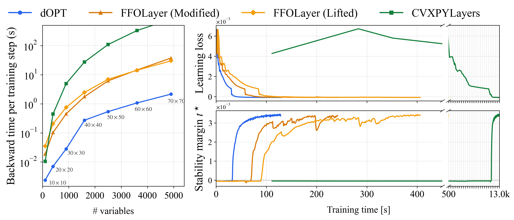

# dOPT
## Differentiating Conic Optimization via Geometric Reduction



This repository implements **dOPT**, a solver-agnostic framework for
differentiating through convex conic optimization. Given a primal-dual solution obtained from any solver,
dOPT uses the local geometry of the active cone constraints to construct a
reduced, first-order equivalent backward problem.

This release includes implementations of a SOCP layer (`src/dSOCP.py`), a
SDP layer (`src/dSDP.py`), and a Lyapunov layer for stable switched linear system learning (`src/dLya.py`).

## Environment setup

Run all commands from the repository root. Create and activate the pinned
Conda environment with:

```bash
conda env create -f environment.yml
conda activate dopt
```

Alternatively, activate another clean Python 3.13 environment and run:

```bash
bash install_dependencies.sh
```

> [!IMPORTANT]
> The examples and paper experiments require a valid [MOSEK license](https://www.mosek.com/products/academic-licenses/).

## Usage

### SOCP

Solve an SOCP of the form

$$
\begin{array}{rl}
\displaystyle\min_z & q^\top z \\
\mathrm{s.t.} & \lVert A_i z+b_i\rVert_2\leq c_i^\top z+d_i,
\quad i=1,\ldots,m, \\
& Fz=g,\quad Gz\leq h.
\end{array}
$$

The example below uses one second-order cone, one equality, and one linear
inequality, and differentiates `z.sum()` with respect to all SOCP parameters:
`q`, `A`, `b`, `c`, `d`, `F`, `g`, `G`, and `h`. `A_dim` gives the row count of
each SOC block; `A`, `b`, `c`, and `d` are stacked across blocks.

```python
import torch
from src.dSOCP import dSOCPLayer

dtype = torch.float64
q = torch.tensor([1.0, 0.3, 0.5], dtype=dtype, requires_grad=True)
A_dim = [3]
A = torch.eye(3, dtype=dtype).requires_grad_()
b = torch.tensor([0.1, 0.0, 0.0], dtype=dtype, requires_grad=True)
c = torch.tensor([[0.05, 0.0, 0.0]], dtype=dtype, requires_grad=True)
d = torch.tensor([1.0], dtype=dtype, requires_grad=True)
F = torch.tensor([[0.0, 1.0, 0.0]], dtype=dtype, requires_grad=True)
g = torch.tensor([0.1], dtype=dtype, requires_grad=True)
G = torch.tensor([[-1.0, 0.0, 0.0]], dtype=dtype, requires_grad=True)
h = torch.tensor([0.5], dtype=dtype, requires_grad=True)

z, *_ = dSOCPLayer(eps=1e-7)(q, A_dim, A, b, c, d, F, g, G, h)
z.sum().backward()
print("z =", z.detach())
for name, parameter in {
    "q": q, "A": A, "b": b, "c": c, "d": d,
    "F": F, "g": g, "G": G, "h": h,
}.items():
    print(f"d(sum(z))/d{name} =", parameter.grad)
```

### SDP

Solve an SDP of the form

$$
\begin{array}{rl}
\displaystyle\min_Z & \mathrm{tr}(C^\top Z) \\
\mathrm{s.t.} & Z\succeq 0, \\
& A\mathrm{vec}(Z)=b.
\end{array}
$$

The example below uses $A\,\mathrm{vec}(Z)=b$ to impose
$\mathrm{tr}(Z)=1$, and differentiates `Z.sum()` with respect to all SDP
parameters: `C`, `A`, and `b`.

```python
import cvxpy as cp
import torch
from src.dSDP import dSDPLayer

dtype = torch.float64
C = torch.diag(torch.tensor([1.0, 2.0], dtype=dtype)).requires_grad_()
A = torch.tensor([[1.0, 0.0, 0.0, 1.0]], dtype=dtype, requires_grad=True)
b = torch.tensor([1.0], dtype=dtype, requires_grad=True)
layer = dSDPLayer(
    n=2, m=1,
    settings={"solver": cp.MOSEK, "solver_args": {"eps": 1e-7}},
)
Z, _, _ = layer(C, A, b)
Z.sum().backward()
print("Z =", Z.detach())
for name, parameter in {"C": C, "A": A, "b": b}.items():
    print(f"d(sum(Z))/d{name} =", parameter.grad)
```

## Reproducing paper experiments

### Synthetic SOCPs and SDPs

These experiments compare dOPT with FFOLayer and CVXPYLayers (we use `diffcp` for SOCPs) on randomly
generated conic programs. The results correspond to Table 6.1. Each setting contains ten problem instances, and the scripts save both per-instance measurements and aggregated results under `random_experiments/results/`.

> [!NOTE]
> CVXPYLayers can be substantially slower on higher-dimensional problems. We recommend running all methods on the smaller instances first. For larger instances, run dOPT and FFOLayer first, then run CVXPYLayers separately if needed or skip it.

For the smaller problems, run all three methods together:

```bash
for dim in 20 100; do
  python -m random_experiments.random_SOCP \
    --dim "$dim" --n-prob 10 --seed-start 121 \
    --methods dOPT ffolayer diffcp
done

for dim in 20 50; do
  python -m random_experiments.random_sdp \
    --dim "$dim" --n-prob 10 --seed-start 121 \
    --methods dOPT ffolayer cvxpylayers
done
```

For the larger problems, it is recommended to run dOPT and FFOLayer first and then run CVXPYLayers separately if needed or skip it:

```bash
for dim in 500 700; do
  python -m random_experiments.random_SOCP \
    --dim "$dim" --n-prob 10 --seed-start 121 \
    --methods dOPT ffolayer
done

for dim in 100 150; do
  python -m random_experiments.random_sdp \
    --dim "$dim" --n-prob 10 --seed-start 121 \
    --methods dOPT ffolayer
done
```

```bash
python -m random_experiments.random_SOCP \
  --dim 500 --n-prob 10 --seed-start 121 \
  --methods diffcp

python -m random_experiments.random_sdp \
  --dim 100 --n-prob 10 --seed-start 121 \
  --methods cvxpylayers
```

### Gradient validation

We validate the gradients at the optimal solution against analytic gradients from the envelope theorem in synthetic SOCPs and SDPs. The results correspond to Table E.1 / Table E.2 in Appendix E. The following commands run
one representative dimension; additional dimensions can be passed to `--dims`. To reproduce the tables in paper, run with `--dims 20 100 500` for SOCPs and `--dims 20 50 100` for SDPs.


```bash
python -m random_experiments.gradient_comparison.compare_socp_gradient \
  --dims 20 --n-prob 10 --seed-start 121 \
  --output random_experiments/results/gradient_comparison/socp_gradient.csv

python -m random_experiments.gradient_comparison.compare_sdp_gradient \
  --dims 20 --n-prob 10 --seed-start 121 \
  --output random_experiments/results/gradient_comparison/sdp_gradient.csv
```

Each command writes both the detailed CSV above and a corresponding
`*_table.csv` file with the same structure as Table E.1 and Table E.2, where the entries are mean relative errors across instances.

### Learning stable switched linear systems

For the switched linear system experiments, we learn the mode matrices
$A_1,\ldots,A_m$ while encouraging stability through a Lyapunov SDP layer. Given the
current mode matrices, a differentiable SDP layer computes the stability
margin $t^*$:

$$
\begin{array}{rcl}
t^*(A_1,\ldots,A_m) & = \displaystyle\max_{P,t} & t \\
& \mathrm{s.t.} & P\succeq 0,\quad \mathrm{tr}(P)=1, \\
& & P-A_i^\top P A_i\succeq tI,\quad i=1,\ldots,m.
\end{array}
$$

A positive margin certifies stability under arbitrary switching of modes.

In this experiment, FFOLayer is compared in two versions:
 
- **FFOLayer (Modified)**: the same non-lifted problem formulation as dOPT and CVXPYLayers, using a
  minimal patch in `ffocp_eq_patch` to support parametric PSD constraints.
- **FFOLayer (Lifted)**: the original FFOLayer implementation applied to an
  equivalent lifted formulation with explicit PSD slack matrices.

#### Synthetic learning experiment
The synthetic experiment evaluates the scalability of the methods on randomly generated switched linear systems as the state dimension increases. The results correspond to Figure 6.1 (Left).

For one quick run:

```bash
python -m learning_synthetic_switched_linear_systems.run \
  --methods dOPT --sizes 5 --epochs 50 --seed 11 \
  --output-dir learning_synthetic_switched_linear_systems/results
```

> [!NOTE]
> CVXPYLayers can be substantially slower on higher-dimensional problems. We recommend running all methods on the smaller instances first. For larger instances, run dOPT and FFOLayer first, then run CVXPYLayers separately if needed or skip it.

First, run all methods on the smaller dimensions:

```bash
for method in dOPT ffo_nonlifted ffo_lifted cvxpylayer; do
  python -m learning_synthetic_switched_linear_systems.run \
    --methods "$method" --sizes 10 20 30 40 --epochs 50 --seed 11 \
    --output-dir learning_synthetic_switched_linear_systems/results
done
```

For larger dimensions, run the three methods except CVXPYLayers at
$n_x=50,60,70$:

```bash
for method in dOPT ffo_nonlifted ffo_lifted; do
  python -m learning_synthetic_switched_linear_systems.run \
    --methods "$method" --sizes 50 60 70 --epochs 50 --seed 11 \
    --output-dir learning_synthetic_switched_linear_systems/results
done
```

Run CVXPYLayers separately at $n_x=50,60,70$; these cases can be especially
time-consuming:

```bash
python -m learning_synthetic_switched_linear_systems.run \
  --methods cvxpylayer --sizes 50 60 70 --epochs 50 --seed 11 \
  --output-dir learning_synthetic_switched_linear_systems/results
```

Collect all available summary files and generate the backward-time figure:

```bash
python -m learning_synthetic_switched_linear_systems.collect_final_results \
  learning_synthetic_switched_linear_systems/results \
  learning_synthetic_switched_linear_systems/results/results.csv
python -m learning_synthetic_switched_linear_systems.plot_backward \
  learning_synthetic_switched_linear_systems/results/results.csv \
  learning_synthetic_switched_linear_systems/results/backward_time
```

#### Vehicle-platoon benchmark

The vehicle-platoon case is part of *Learning Stable Switched Linear Systems*.
Its 10-vehicle learning curves correspond to Figure 6.1 (Right), and the results of all cases correspond to Table 6.2 / Table D.1 in Appendix D.

Benchmark source: [3-vehicle platoon](https://easychair.org/publications/paper/3QLs/open), [5-vehicle / 10-vehicle platoon](https://ths.rwth-aachen.de/research/projects/hypro/n_vehicle_platoon/) (included in `vehicle_platoon_learning/data/`)


First run dOPT and both FFOLayer formulations for 3, 5, and 10 vehicles:

```bash
bash vehicle_platoon_learning/reproduce_vehicle_platoon.sh
```

CVXPYLayers is substantially slower and can be run separately if needed or skip it:

```bash
bash vehicle_platoon_learning/reproduce_vehicle_platoon_cvxpylayers.sh
```

Generate Figure 6.1 (Right):

```bash
python -m vehicle_platoon_learning.plot_curves_vs_time \
  --results-dir vehicle_platoon_learning/results \
  --output vehicle_platoon_learning/results/10vehicle_platoon_loss_t_star.pdf
```

Included paper-run results are kept separately in `vehicle_platoon_learning/results/reference_results/`.

To plot Figure 6.1 (Right) from the included reference results without
rerunning training:

```bash
python -m vehicle_platoon_learning.plot_curves_vs_time \
  --results-dir vehicle_platoon_learning/results/reference_results
```
